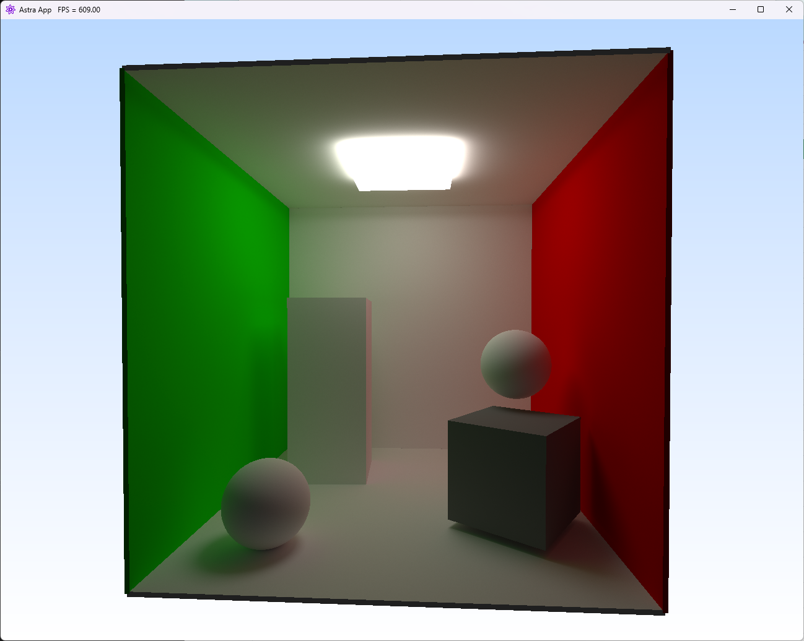
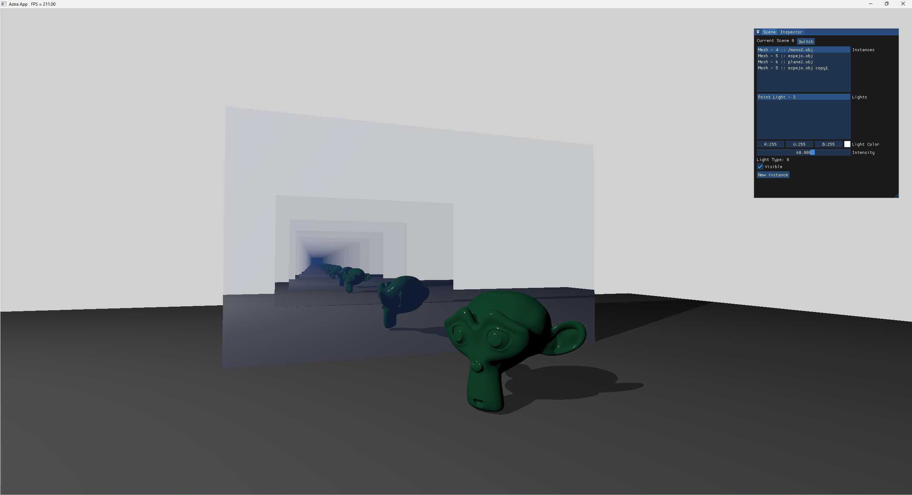
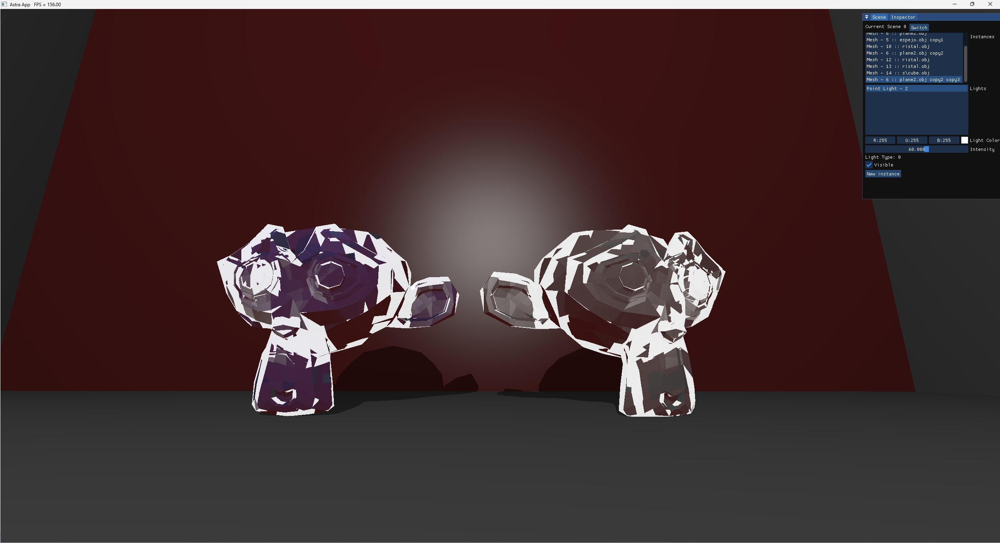
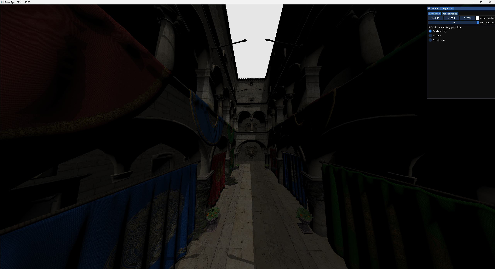

# AstraExamples

This repository contains demos of the [AstraCore library](https://github.com/PinGunter/AstraEngine).

Currently there is only one example as the library is in active development. 

### Simple pathtracer

### Basic Wavefront (.obj) visualizator (SceneEditor)

A simple app to visualize multiple .obj models. It supports multiple scenes and guizmos to transform the objects. It allows you to switch from different pipelines: ray-traced, raster and wireframe.

